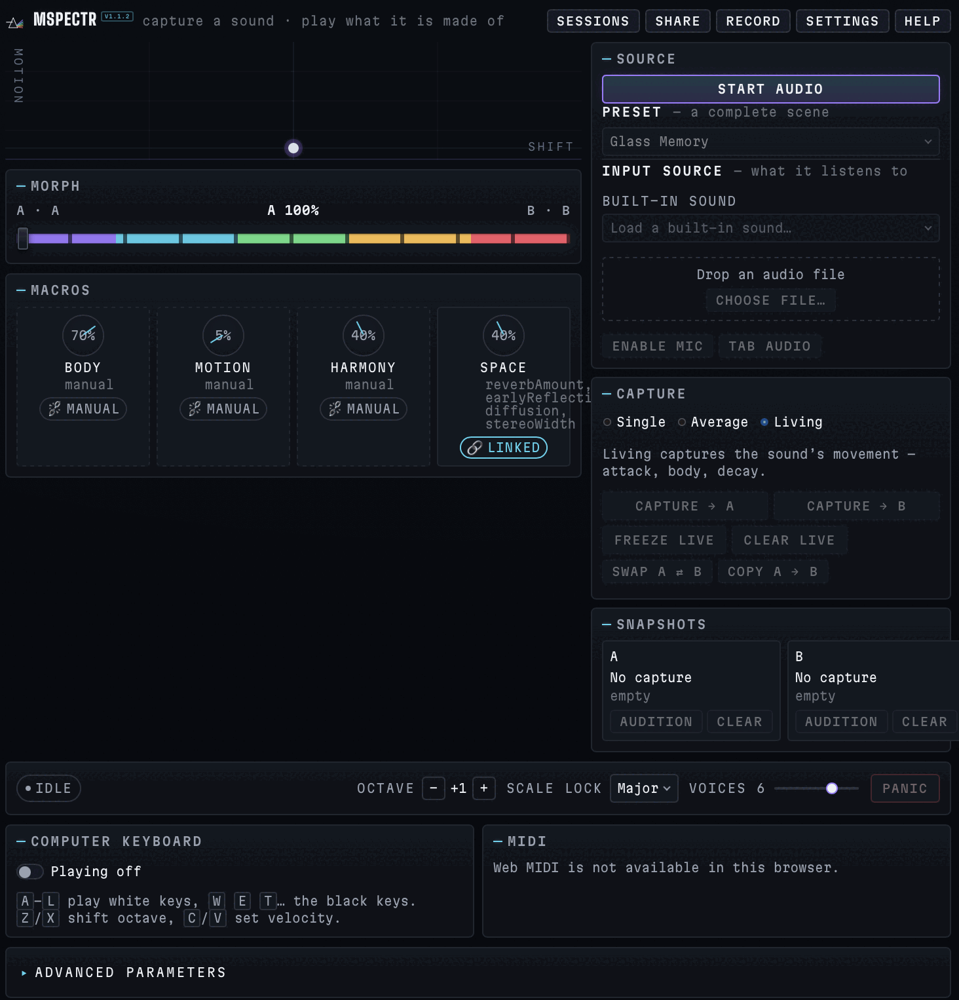

<div align="center">

# mspectr

**Capture a sound. Play what it is made of.**

[](./package.json)
[](./LICENSE)
[](#verification)
[](./tsconfig.json)
[](https://react.dev)
[](https://vite.dev)
[](https://developer.mozilla.org/docs/Web/API/AudioWorklet)
[](#progressive-web-app)

### [▶ Play it live → mspectr.mpump.live](https://mspectr.mpump.live)



</div>

---

`mspectr` is a browser-native spectral freeze & performance instrument — capture a sound's spectral identity, then play, morph, and shift it. Feed it a generated sound, an audio file, a microphone, or a browser tab; capture one or two spectral identities; then play, morph, shift, blur, harmonize, and spatialize what those sounds are made of. It stores and plays spectral **snapshots** — a frozen frame, or an average of eight — not time-varying partial tracks, so what you play is a captured spectral identity rather than an evolving resynthesis of a sound's moving partials. It stores spectra rather than recordings, runs its analysis and synthesis in an `AudioWorklet`, and stays local-first: no account, no cookies, no telemetry, and no audio uploads.

## Highlights

- **Capture sound as identity** — freeze a single spectral frame or average eight frames into Snapshot A or B. Each snapshot stores magnitude plus optional phase — derived spectral data, not the raw waveform (though it is lossy and only approximately reconstructible).
- **Morph between two timbres** — the central A↔B control interpolates captured spectra continuously; swap slots, copy A to B, clear them, or audition either endpoint.
- **A full spectral chain** — morph, tilt, blur, gate, pitch resampling with optional formant-preserving (keytrack) transposition, formant shift, additive frequency shift, harmonization, and locked or seeded-animated phase feed stereo space, reverb, and a linked limiter.
- **Four performance macros + XY** — Body · Motion · Harmony · Space resolve to concrete engine parameters. Link/Unlink keeps hand-edited values authoritative, and the XY axes are configurable.
- **Flexible sources** — fourteen (14) deterministic generated sounds, drag-and-drop audio files, microphone/device input, and browser-tab audio where the platform supports it. Microphone and tab sources never monitor through the output, preventing feedback.
- **Polyphonic performance** — Ableton-style computer keyboard and optional Web MIDI input, scale lock, octave control, velocity, pitch bend, sustain, panic, and up to eight voices with deterministic stealing.
- **Three quality modes** — Eco, Normal, and High trade responsiveness for frequency detail using 1024-, 2048-, and 4096-point FFTs at 75% overlap.
- **23 authored presets** — frozen, metallic, textural, and organ voices provide useful starting points without hiding the underlying parameters.
- **Save, share, and record** — versioned IndexedDB sessions, validated JSON import/export, backend-free patch links, opt-in embedded-snapshot links with size and consent gates, and master-output WAV recording.
- **Installable PWA** — network-first navigation and precached hashed assets make the complete instrument available offline after one successful visit.

## Run locally

```bash
npm install
npm run dev
```

Open the URL Vite prints and click **Start audio** (browser audio requires a user gesture). Use headphones before enabling a microphone.

## Scripts

| Script | Purpose |
| --- | --- |
| `npm run dev` | Vite dev server with HMR |
| `npm run build` | Type-check (`tsc -b`) and production build |
| `npm run preview` | Serve the production build locally |
| `npm run lint` | ESLint |
| `npm run test` | Vitest (run once) |
| `npm run test:watch` | Vitest in watch mode |
| `npm run typecheck` | Type-check without emit |
| `npm run check` | **lint + typecheck + test + build** (the full gate) |

## Keyboard

Computer-keyboard input must be enabled in the instrument. Shortcuts are ignored while typing into a field.

| Keys | Action |
| --- | --- |
| `A W S E D F T G Y H U J` | play C through B chromatically |
| `K O L P ;` | continue into the next octave |
| `Z` / `X` | octave down / up |
| `C` / `V` | velocity down / up |
| `Space` | freeze / unfreeze the live spectrum |
| `Esc` | close the active dialog |

## Architecture

```text
sources                              main thread                         audio thread
───────                              ───────────                         ────────────
generated · file · mic · tab ───────▶ AudioEngine ─────────────────────▶ AudioWorklet
                                           │                                  │
React UI ─▶ reducer ─▶ macros + XY ─▶ resolved SpectralParams                 ├─ STFT analysis
                                           │                                  ├─ Snapshot A/B capture
keyboard · Web MIDI ─▶ note routing ───────┘                                  ├─ spectral snapshot synthesis
                                                                              └─ space + linked limiter
                                                                                       │
IndexedDB sessions ◀── validated snapshots + patches ◀── engine events ◀───────────────┘
```

- **The DSP core is pure** — FFT, STFT, overlap-add, spectral operators, reverb, and limiting have no React or DOM dependencies and run directly in Node tests.
- **Audio-rate work stays off the UI thread.** One `SpectralEngine` inside the worklet owns analysis, snapshot capture, voice rendering, envelopes, overlap-add, space, and limiting.
- **The main thread sends resolved values.** Macros and XY mappings are converted to finite, bounded `SpectralParams` before crossing the worklet boundary.
- **Every storage and sharing boundary is validated.** Persisted JSON, URL fragments, worklet messages, and local Link data are clamped or rejected before they can allocate buffers or enter DSP math.

See [`docs/architecture.md`](./docs/architecture.md) and [`docs/dsp.md`](./docs/dsp.md) for detail.

## Verification

```bash
npm run check   # lint + typecheck + 452 tests + production build
```

Tests are deterministic and live next to the code. They cover FFT/STFT reconstruction, spectral operations, limiter and reverb behavior, engine capture and voice flow, presets and macros, keyboard and MIDI routing, generated/file sources, persistence, sharing codecs, WAV export, visualization, React state, and core UI flows. Live audio devices remain part of the manual browser/device checklist.

## Privacy

Everything is local. There are no accounts, cookies, ads, analytics, or uploads. Microphone and tab audio are analyzed only on your device and are never monitored through the output. Snapshots contain derived spectral data rather than recordings; patch-only links are the default, and embedding live-derived snapshots requires explicit consent.

Saved sessions live in versioned IndexedDB. Share links put validated state in the URL fragment, so it is not sent to the server. See [`docs/privacy.md`](./docs/privacy.md).

## Browser notes & limitations

- Audio starts only from a user gesture (the **Start audio** button), per browser policy.
- `AudioWorklet` and the Web Audio API are required for the spectral engine.
- **Web MIDI** is optional and appears only where the browser exposes it.
- Browser-tab audio capture is platform-dependent and currently offered only when supported.
- Microphone and tab capture require explicit permission; microphone device selection depends on browser support.
- A PWA install does not provide background or lock-screen audio.

See [`docs/qa-checklist.md`](./docs/qa-checklist.md) for the release test matrix.

## Repository map

```text
src/
  audio/              contracts, engine adapter, worklet, pure spectral DSP
    dsp/               FFT · STFT · overlap-add · spectral ops · reverb · limiter
    worklets/          AudioWorklet adapter around SpectralEngine
  app/                reducer, UI composition, engine/React bridge
  components/         source, capture, snapshots, morph, macros, sessions, sharing
  instrument/         scale quantization, QWERTY keyboard, voice allocation
  midi/               optional Web MIDI parsing and note ownership
  performance/        authored presets, macro resolution, motion helpers
  persistence/        versioned IndexedDB instruments and snapshots + JSON I/O
  recording/          AudioWorklet WAV recorder with safe fallback
  sharing/            validated patch and embedded-snapshot URL codecs
  sources/            generated, file, microphone, and tab inputs
  transport/          optional Ableton Link bridge client
  visualization/      spectrum/XY canvas rendering
  styles/             global instrument UI and responsive layout
public/               manifest, service worker, icons, CNAME, robots
.github/workflows/    CI + GitHub Pages deploy
docs/                 architecture, DSP, privacy, and manual QA
```

## Progressive Web App

`public/manifest.webmanifest` + `public/sw.js` make `mspectr` installable. The service worker is **network-first for navigations** and cache-first for content-hashed assets. A Vite plugin emits `precache-manifest.json` during production builds, allowing the worker to precache the complete shell and bundled assets for offline use after the first successful load.

## Deployment

Pushes to `main` are deployed by GitHub Actions to GitHub Pages at **[mspectr.mpump.live](https://mspectr.mpump.live)**. The build is root-relative, and `public/CNAME` preserves the custom domain. Set **Settings → Pages → Source** to **GitHub Actions** if prompted.

## Family

mspectr is part of the **mpump** family of browser-native instruments — alongside [mpump](https://mpump.live), [mdrone](https://mdrone.mpump.live), [mgrains](https://mgrains.mpump.live), [mloop](https://mloop.mpump.live), [mchord](https://mchord.mpump.live), and others. Reused code is credited in [`NOTICE`](./NOTICE).

## License

[GNU Affero General Public License v3.0 or later](./LICENSE).
